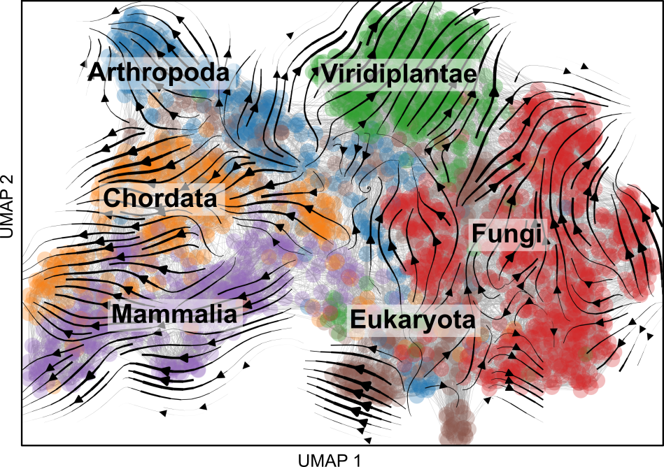

# Evolocity

Evolocity is a Python package that implements evolutionary velocity, which constructs landscapes of protein evolution by using the local evolutionary predictions enabled by language models to predict the directionality of evolution and is described in the paper "Evolutionary velocity with protein language models" by Brian Hie, Kevin Yang, and Peter Kim. This repository also contains the analysis code and links to the data for reproducing the results in the paper.

Evolocity is a fork of the [scVelo](https://github.com/theislab/scvelo) tool for RNA velocity by [Bergen et al.](https://www.nature.com/articles/s41587-020-0591-3) and relies on many aspects of the [Scanpy](https://scanpy.readthedocs.io/en/stable/) library for high-dimensional biological data analysis. Like Scanpy and scVelo, evolocity makes use of [anndata](https://anndata.readthedocs.io/en/latest/), a convenient way to store and organize biological data.

- [Documentation](#documentation)
- [Installation](#installation)
- [API example and tutorials](#api-example-and-tutorials)
- [Testing](#testing)
- [Experiments](#experiments)

## Documentation

For in-depth API documentation, go to https://evolocity.readthedocs.io.

## Installation

You should be able to install evolocity using `pip`:
```bash
python -m pip install evolocity
```

## API example and tutorials

Below is a quick Python example of using evolocity to load and analyze sequences in a FASTA file.
```python
import evolocity as evo
import scanpy as sc

# Load sequences and compute language model embeddings.
fasta_fname = 'data.fasta'
adata = evo.pp.featurize_fasta(fasta_fname)

# Construct sequence similarity network.
evo.pp.neighbors(adata)

# Run evolocity analysis.
evo.tl.velocity_graph(adata)

# Embed network and velocities in two-dimensions and plot.
sc.tl.umap(adata)
evo.tl.velocity_embedding(adata)
evo.pl.velocity_embedding_grid(adata)
evo.pl.velocity_embedding_stream(adata)
```

More detailed documentation is provided [here](https://evolocity.readthedocs.io).

**Tutorials** are also available in the [documentation](https://evolocity.readthedocs.io) and also on Google Colab for [influenza A nucleoprotein](https://colab.research.google.com/drive/143vxIqgIO1bWbC1FJ0q_Ja8eZN603uwM?usp=sharing) and [cytochrome c](https://colab.research.google.com/drive/1Eav24ijOnT5JWRNWan4iuhnMfu_WpZE4?usp=sharing).

## Testing

Unit tests require using [pytest](https://docs.pytest.org/en/latest/) and can be run with the command
```
python -m pytest tests/
```
from the top-level directory.

## Experiments

Below are scripts for reproducing the experiments in our paper. To apply evolocity to your own sequence data, we also encourage you to check out the tutorials in the [documentation](https://evolocity.readthedocs.io).

### Data

You can download the [relevant datasets](DATA_URL) (including training and validation data) using the commands
```bash
wget DATA_URL
tar xvf data.tar.gz
ln -s data/target/ target
```
within the same directory as this repository. Be sure to move the `target/` directory one level up or create a symlink to it (as done above).

### Dependencies

Before running the scripts below, we encourage you to use the [conda](https://docs.conda.io/en/latest/) environment in [environment-epi.yml](environment-epi.yml) using
```bash
conda env create --file environment-epi.yml
```
ESM-1b and TAPE need to be installed separately as described in [https://github.com/facebookresearch/esm](https://github.com/facebookresearch/esm) and [https://github.com/songlab-cal/tape](https://github.com/songlab-cal/tape), respectively (PyTorch may need to be reupdated after TAPE installation).

Our experiments were run with Python version 3.7 on Ubuntu 20.04.

### Evolocity analysis

Our main evolocity analyses can be reproduced using the command
```bash
bash bin/main.sh
```
which will create new log files and figures in a new `figures/` directory.

### Scripts for other analyses

Phylogenetic tree reconstruction of NP and ancient proteins can be done with the commands below (you will first need to install [PhyML](https://github.com/stephaneguindon/phyml) and [FastTree](http://www.microbesonline.org/fasttree/#Install)):
```bash
bash bin/phylo_np.sh > phylo_np.log 2>&1
bash bin/phylo_eno.sh > phylo_eno.log 2>&1
bash bin/phylo_pgk.sh > phylo_pgk.log 2>&1
bash bin/phylo_ser.sh > phylo_ser.log 2>&1
```

Deep mutational scan benchmarking can be done with the command
```bash
python bin/dms.py esm1b > dms_esm1b.log 2>&1
python bin/dms.py tape > dms_tape.log 2>&1
```
